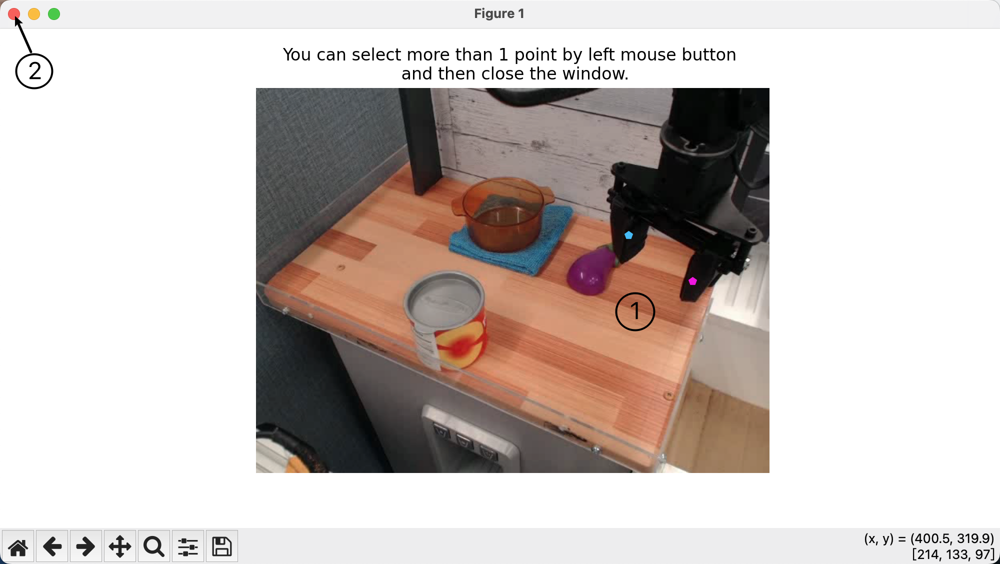
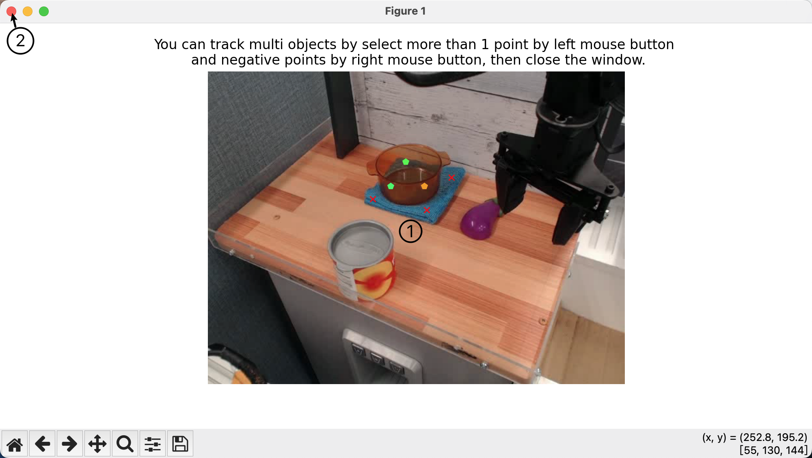

# A Simple Tools for Tracking any points in a video or Tracking any objects in a video by mask

## Installation
```bash
conda create -n tracker python=3.11
conda activate tracker
pip install -r requirements.txt
pip install torch==2.3.1 torchvision==0.18.1 torchaudio==2.3.1 --index-url https://download.pytorch.org/whl/cu118
mkdir checkpoints
wget -P checkpoints https://storage.googleapis.com/dm-tapnet/bootstap/bootstapir_checkpoint_v2.npy
git clone https://github.com/facebookresearch/segment-anything-2.git
cd segment-anything-2
pip install -e .
cd checkpoints
wget https://dl.fbaipublicfiles.com/segment_anything_2/072824/sam2_hiera_large.pt
cd ..
git clone https://github.com/facebookresearch/co-tracker
cd co-tracker
pip install -e .
mkdir checkpoints
cd checkpoints
wget https://huggingface.co/facebook/cotracker/resolve/main/cotracker2.pth
```

## Usage
```bash
python main.py --mode <mode> --config <config_file> --device <device>
```

## Mode
- `tap`: Track any number points in a video **(no more than 20 points)**, you can add points by clicking on the selected frame, and finish by just close the window, as the following demo:
<div align=center>
 
</div>


- `mask`: Track any objects in a video by mask, you can add mask by drawing on the selected frame, you can click left mouse button to add positive points, and right mouse button to add negative points, and finish by just close the window, as the following demo:
<div align=center>
 
</div>